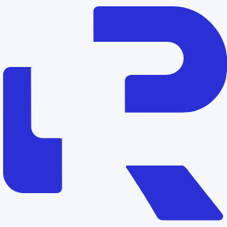
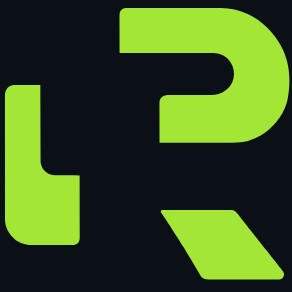

# Reflog Labs — Site Reference

You are a senior front-end engineer and designer. Build **one self-contained `index.html`** (HTML + CSS + vanilla JS, no build step, no frameworks, no external JS) for **Reflog Labs**, a GitHub organization (`github.com/reflog-labs`) that teaches beginners-to-intermediates how open-source contribution works, one hands-on lab repo at a time. Tagline: **"Where history is never lost."** Sub-line: **"Open source, built and broken in the open."** The site will be hosted on GitHub Pages as `reflog-labs.github.io`.

Visual direction: **cool neo-brutalism with precise, instrument-like details**. Two-tone, flat, thick borders, hard shadows, huge type, contour lines, and memorable animations. It must feel designed, not templated. It must load fast.

The brand logo is `./assets/logo.svg` (an "R" made of 3 paths). Read it before doing anything else.

---

## 1. Hard constraints

- Output: **one file, `index.html`**. All CSS and JS inline. The only external requests allowed: Google Fonts (CSS + font files) and `https://api.github.com`.
- Performance targets: HTML <= ~80 KB uncompressed, Lighthouse Performance >= 95 on mobile, no layout shift (CLS ~= 0), first content visible < 1 s on fast 4G. Content must already be in the DOM (no JS-rendered blank page); the loader is an overlay, not a gate.
- Animate only `transform`, `opacity`, `clip-path`, and `stroke-dashoffset`. Pause all animation when off-screen (IntersectionObserver) and when the tab is hidden. Use `will-change` sparingly.
- Accessibility: semantic landmarks, skip link, visible orange focus ring (`outline: 3px solid var(--accent); outline-offset: 3px`), `aria-live="polite"` on the lab-status region, all interactive things keyboard-reachable, alt/aria labels on icon-only buttons.
- `prefers-reduced-motion: reduce` -> no loader, no parallax, no looping motion; state changes become instant. Everything must still work and look good.
- No-JS fallback: page renders with all labs shown as locked and the default light/dark theme from `prefers-color-scheme`.
- **Never** insert GitHub API data with `innerHTML`. Use `textContent` / DOM APIs only.
- Do not mention or reference any detective theme, "os-trainer", or any personal account anywhere on the site. The only external identity is the `reflog-labs` org.

---

## 2. Design tokens (sampled from the logo, contrast-checked)

```css
:root {                      /* LIGHT */
  --ground:  #D3FBFE;        /* page background (logo background) */
  --surface: #E5FFFE;        /* cards, panels (logo notch color) */
  --ink:     #0203D0;        /* brand blue: borders, lines, headings, logo */
  --text:    #07073A;        /* body text (17:1 on ground) */
  --muted:   #3A3AA0;        /* secondary text (8.3:1) */
  --accent:  #FF5B1F;        /* signal orange */
  --on-accent: #07073A;      /* text on orange (6.15:1) */
  --shadow:  #0203D0;
  --bw: 3px;
}
:root[data-theme="dark"] {   /* DARK */
  --ground:  #06062E;
  --surface: #0B0B45;
  --ink:     #9BF0FF;        /* cyan lines/headings (15:1) */
  --text:    #E5FFFE;
  --muted:   #8FA8D8;
  --accent:  #FF6A2E;
  --on-accent: #06062E;
  --shadow:  #4B4DFF;        /* decorative only, never text */
}
```

Rules:
- **60 / 30 / 10**: ~60% ground, ~30% ink, <= ~10% orange.
- Orange is used ONLY for: the primary CTA fill, focus rings, "LIVE" stickers, the single active/HEAD marker, the unlock flash, and the terminal's success line. **Never orange text on the light ground** (2.8:1, fails). Text on orange is always `--on-accent`. Never blue text on orange.
- Define tokens on `:root`, redefine for `@media (prefers-color-scheme: dark)` guarded as `:root:not([data-theme="light"])`, and again for `:root[data-theme="dark"]`. Give `body` an explicit background.
- Brutalist rules: 3px solid `--ink` borders, hard offset shadows with **zero blur** (`6px 6px 0 var(--shadow)`), flat fills, no gradients, no glassmorphism, no neon glow, no stock photo imagery, no emoji as icons. Pressing/hovering a button translates it toward its shadow.
- Visible grid feel: section labels in mono like `// 02 labs`, thin ruled lines, tabular numbers.

**Fonts** (Google Fonts, `display=swap`, `preconnect` both hosts):
`https://fonts.googleapis.com/css2?family=DM+Mono:wght@400;500&family=Unbounded:wght@700;900&display=swap`
- **Unbounded 900** for display headings and the giant wordmark. Wide font: use `clamp()` and verify nothing overflows at 320 px.
- **DM Mono 400/500** for everything else (nav, labels, body, code, terminal).
- Fallback stacks: `ui-monospace, "SF Mono", Menlo, monospace` and `system-ui, sans-serif`. Add `size-adjust`/`ascent-override` fallback faces if easy, to prevent layout shift.

---

## 3. The logo (`./assets/logo.svg`)

The file is a raw VTracer export: 3 paths (bowl, lower-left block, leg), `viewBox="0 0 1254 1254"`, ~304 curve segments, and has junk to strip. **Do not redraw or alter the geometry.** Only clean it:

1. Remove the `<?xml ?>` header, the generator comment, `id="svg"`, and the inline `style` on the `<svg>` (it sets a white background, which breaks dark mode).
2. Remove the inline `style="fill:#000000"` on the paths and use `fill="currentColor"`.
3. Bake each path's `transform="translate(...)"` into the path data (or keep the transforms if baking risks error). Round numbers to **1 decimal**. Keep it a valid, visually identical shape.
4. Give the three paths ids: `r-bowl` (top/right big shape), `r-block` (lower-left), `r-leg` (diagonal). Approximate bounding boxes in the 1254 box, to verify nothing moved: bowl x 241-1242 / y 29-811; block x 37-471 / y 296-1225; leg x 481-1197 / y 822-1225.
5. Define it once as an inline `<svg style="display:none">` with `<symbol id="logo" viewBox="0 0 1254 1254">` (or the three paths as `<defs>`), and reuse via `<use>` for the nav mark, loader, hero, footer, and favicon.

**Favicon:** an inline SVG data-URI `<link rel="icon" type="image/svg+xml" href="data:...">` : the R in `#D3FBFE` on a solid `#0203D0` rounded square with generous padding (the R fills ~96% of its canvas, so it needs padding). Include a `prefers-color-scheme` variant inside the SVG. Check legibility at 16 px.

**Contour rings (signature motif):** the rings are NOT in the SVG. Generate them in code around the R. Technique: stack the same three R paths via `<use>`, drawn from the widest to the narrowest stroke, alternating ring color (`--ink`) and ground color, with `stroke-linejoin: round`. Draw order per level: all three pieces at level k before level k+1, so the pieces merge into one outline. Use ~14 rings, then the solid R on top in `--ink`. Verify they look like concentric echoes of the R, like the original logo art. Rings must recolor with the theme.

---

## 4. Theme system

- Default from `prefers-color-scheme`; manual toggle persisted in `localStorage` (wrap in try/catch). An **inline script in `<head>`** sets `data-theme` before first paint (no flash). The loader and everything else must match the active theme.
- Toggle is a chunky square switch (sun/moon, drawn in CSS/inline SVG) in the nav and footer.
- **Ring-wipe transition:** toggling uses `document.startViewTransition` with a `clip-path: circle()` that expands from the toggle's center so the new theme sweeps across like a ripple. Fallback if unsupported: a 200 ms crossfade. Reduced motion: instant.
- Keyboard: `t` toggles theme (ignore when typing in an input).

---

## 5. Page structure (in order)

### 5.0 Loader (first visit per session only; ~1.6 s, hard cap 2.2 s)
Overlay on top of already-rendered content. Beats: (1) the three R pieces slide in from different directions and lock, the lower-left block first, then the bowl, then the leg; (2) contour rings ripple outward one by one, staggered; (3) a mono log stacks up quickly beside/below the mark, e.g. `HEAD@{3}: init` -> `HEAD@{2}: add logo` -> `HEAD@{1}: load fonts` -> `HEAD@{0}: ready`, with the last line in orange; (4) the rings keep expanding past the viewport and become the hero background (shared-element handoff, not a fade). Skip on repeat visits (`sessionStorage`), skip on click/keypress, skip entirely with reduced motion. Never artificially wait longer than the real load needs.

### 5.1 Nav
Sticky, bordered bar: R mark + `reflog` wordmark (DM Mono 500), links (Labs, Loop, Undo, Terminal, GitHub to `https://github.com/reflog-labs`), a small decorative mono chip `HEAD -> main`, and the theme toggle. Logo hover pulses its rings once. Shrinks slightly on scroll. Mobile: a bordered menu button opening a full-width brutalist panel.

### 5.2 Hero
- Giant `REFLOG` in Unbounded 900, the tagline, the sub-line, and two buttons: **primary (orange fill)** and secondary "View on GitHub". The primary button depends on live state (see ss6): zero labs live -> "Labs unlock soon" (links to the Labs section); at least one live -> "Start Lab NN" (links to that repo, lowest live number).
- Background: the **ring stack from ss3**, huge and cropped by the viewport, slowly "breathing". **Pointer parallax:** each ring layer shifts a few px by a different factor from pointer position, giving a tunnel/depth feel (on touch devices: slow auto-drift). Use the normal cursor; **no custom cursor**.
- Headline lines reveal with a masked slide-up. Add a small mono line under the buttons: `HEAD@{0}: <n> of 12 labs unlocked` (updates from live state).

### 5.3 How it works ("Loop")
- A one-sentence manifesto at the top whose words light up as you scroll through it: *"Every mistake is recoverable. That's the point of the reflog."*
- A **horizontal SVG loop diagram**: Fork -> Branch -> Pull Request -> Merge, with a one-line caption under each step. The connecting path **draws itself** on scroll (`stroke-dashoffset`) and an orange commit dot travels along it once, then idles at the end. Hovering/focusing a step highlights it. Mobile: a 2x2 grid with arrows, still designed, with simple reveal animation.

### 5.4 Labs (the core; see ss6 for the live engine)
Header: `// 04 labs` + a status line (`3 / 12 unlocked, synced 14:02`) + filter chips: **All, Foundations, Collaboration, Craft, Quality and Ship**. A responsive grid of 12 cards (3 columns desktop, 2 tablet, 1 mobile). **Everything is locked at launch**; cards unlock automatically from GitHub (ss6). Below the grid, a wide locked **Advanced strip** (static, always locked): *Bisect and internals, Hooks and signed commits, Maintainer mode (CODEOWNERS, branch protection, triage), Supply-chain security*.

**Locked card:** dashed 3px border, diagonal hatch pattern background (`repeating-linear-gradient`, subtle), big index number `01`, track name, a padlock glyph (small inline SVG), the title and description replaced by solid redaction bars of varied widths (deterministic per card), and a mono `LOCKED` tag. Click/Enter -> short shake + a tooltip "Locked: unlocks when this lab's repo goes public."

**Live card:** solid 3px border, hard shadow, `LIVE` sticker in orange, the title, the **repo description**, up to 3 repo topics as small tags, language, "updated 3d ago", stars only if > 0, and a bottom row with **"Open repo"** and **"What you'll learn +"**. Hover: card lifts, shadow flips direction, and a **contour-line pattern blooms from the card's corner** (`repeating-radial-gradient`, animate background-size/opacity).

**Diff drawer ("What you'll learn +"):** the card expands in place (FLIP animation, grid reflows smoothly) into a **git-diff-styled panel** in DM Mono: green `+` lines = what you'll learn, red lines = habits you'll drop. Use the per-lab lines from the config in ss6. (Use accessible colors: green/red must also be distinguished by the `+`/`-` glyphs and background tint, not color alone, in both themes.) Escape closes it.

**Unlock animation** (plays once per card per session, when a card first renders as live, staggered ~120 ms, triggered as it scrolls into view): padlock shackle lifts and drops away -> redaction bars wipe off left-to-right revealing the real text -> border flips from dashed to solid -> a one-frame orange flash on the sticker -> shadow "thuds" in. Reduced motion: instant.

### 5.5 The Undo Machine (signature interaction; keep the JS small, ~2 KB)
A bordered "editor" card titled `lesson-plan.md` holding ~6 short lines of real-looking content. A red-tinted button: **`git reset --hard HEAD~3`** ("delete my work"). On click: the text scrambles per-character, then collapses to empty; a status line says `HEAD is now at 9f2c1ab` and a caption "Gone?". Then a **reflog panel** slides in listing entries, e.g. `HEAD@{0}: reset: moving to HEAD~3`, `HEAD@{1}: commit: add final section`, `HEAD@{2}: commit: add examples`, `HEAD@{3}: commit: draft outline`. Clicking (or Enter on) `HEAD@{1}` runs `git reset --hard HEAD@{1}` and the text **rewinds back** with a restoring animation (characters re-typed fast while the contour rings flow inward). A "reset demo" link reloads the initial state. Caption: *"Nothing's really gone: Git keeps unreachable commits for weeks by default. The reflog is your undo button."* Fully keyboard-operable; reduced motion = instant swaps.

### 5.6 Terminal
A brutalist terminal window (3px border, hard shadow, title bar `reflog@labs`). When scrolled into view it **auto-types** one command (`git log --oneline`), then shows an interactive prompt. Features:
- **Tab autocomplete with ghost text** (dimmed completion shown after the cursor), `Enter` runs, **up/down arrow command history**.
- Auto-focus only on user click (don't steal scroll on load). Mobile: tapping the window focuses the input; keep the hint text visible.
- Commands (keep total JS ~3 KB): `help`, `clear`, `whoami` (what Reflog is), `labs` and `git log --oneline` (one line per lab: fake 7-char SHA derived deterministically from the slot number, e.g. `a3f9c21 lab-01 First Commit`; locked ones print `(locked)`; live ones are real from ss6), `git status` (`On branch main, 3 labs unlocked, 9 locked`), `open NN` (opens the repo if live, else prints `lab NN is locked`), `git reflog` (prints the **visitor's own commands this session** as `HEAD@{n}: <command>`), `theme dark|light`, `git blame` (joke: `blame: it was you, six commits ago`), `sudo` (`permission denied. confidence appreciated.`), `rm -rf /` (`recoverable. try: git reflog`), `git push --force` (`use --force-with-lease, you animal`). Unknown input: `command not found: x (try 'help')` and suggest the closest command.
- A command typed from a successful action (e.g. `open 01` on a live lab) prints its success line in orange.
- Output is rendered via `textContent`. Escape key blurs the input.

### 5.7 Final CTA band and footer
- Full-width **orange block**: "Your first PR starts here." with the same state-dependent button as the hero. Hovering the block ripples a few contour rings outward from the pointer (cheap CSS circles).
- Footer: cropped giant `REFLOG` wordmark, link to `https://github.com/reflog-labs`, repeat theme toggle, and a build line `HEAD@{0}: built with one index.html, 0 dependencies`. A back-to-top link. Clicking the footer logo fires a ring burst.

---

## 6. Live labs engine (important: everything dynamic)

**Goal:** all 12 labs start locked. When I create a public repo in the org following the naming convention, it unlocks automatically and shows its own GitHub description. No code changes.

**Data source:** `GET https://api.github.com/orgs/reflog-labs/repos?type=public&per_page=100&sort=created&direction=asc` with header `Accept: application/vnd.github+json`. **No auth headers, no tokens.** One request per page load.

**Matching:** a repo is a lab if `name` matches `^lab-(\d{2})-(.+)$` and it is not `archived` and not private. `NN` selects the slot. Title = slug to Title Case (`first-commit` to "First Commit"). If two repos claim one slot, use the oldest and `console.warn`. A matching repo whose `NN` is not in the slot table (e.g. `lab-13-...`) is **appended as an extra live card** (track "More"). Other repos (`.github`, `reflog-labs.github.io`, etc.) are ignored.

**Card fields (from the API):** `description` (if null/empty show "No description yet." in muted text), `html_url`, `language`, `pushed_at` (relative time), `stargazers_count` (show only if > 0), `topics` (max 3 tags).

**States and honesty:**
- `LOCKED`: API reachable, no matching repo.
- `LIVE`: matching repo found.
- `UNAVAILABLE`: API failed (network, rate-limit 403/429) **and** no cache -> cards show a neutral `COULDN'T CHECK` tag, not "locked", and the status line says "Couldn't reach GitHub." Never imply a lab doesn't exist when the check failed.
- **Cache:** store the last good result in `sessionStorage` (`reflog:labs:v1`, with timestamp). On load, render from cache immediately if < 5 min old and skip the request; if older, render cached state then revalidate in the background and animate any newly unlocked cards. On failure fall back to the cache, and if there is none, `UNAVAILABLE`.
- Status line: `N / 12 unlocked, synced HH:MM`.
- **Hero/CTA/terminal/status text all derive from the same state object** (single source of truth; re-render on change).

**Testing hook (keep in the final file; it's tiny):**
- `?mock=01,02,04` -> pretend repos `lab-01-first-commit`, `lab-02-branch-out`, `lab-04-fork-it` exist (description "Mock description for lab NN.", language "Shell", pushed 2 days ago, topics `git`, `basics`). `?mock=all` -> all 12 live. `?mock=offline` -> simulate a failed request. `?mock=none` -> none. With a mock param, skip the cache.

**Slot config (put at the top of the script as one `const LABS = [...]`):**

| NN | Track | Level | Diff lines (learn / drop) |
|----|-------|-------|------|
| 01 | Foundations | Basic | + `git init`, `git add -p`, `git commit -m "clear message"` / + read history with `git log --oneline` / - committing `node_modules` and secrets (use `.gitignore`) / - messages like "stuff" and "final_v2" |
| 02 | Foundations | Basic | + `git switch -c feature/x` / + fast-forward vs merge commit / - working directly on `main` / - branch names like "test2" |
| 03 | Foundations | Basic | + `git clone`, `git remote -v`, `git push -u origin branch` / + SSH key or token auth / - pasting a token into the remote URL |
| 04 | Collaboration | Basic | + fork, clone, `git remote add upstream` / + sync your fork with upstream / - opening PRs from a stale `main` |
| 05 | Collaboration | Basic | + reproduce first: steps, expected vs actual / + labels, issue templates, read `CONTRIBUTING.md` / - "it doesn't work" / - filing duplicates without searching |
| 06 | Collaboration | Intermediate | + branch -> push -> open PR, link with `Fixes #12` / + describe what, why, how you tested / - giant PRs mixing unrelated changes / - empty PR descriptions |
| 07 | Craft | Intermediate | + read conflict markers / + resolve, `git add`, continue the merge / - deleting both sides to make markers vanish / - committing conflict markers |
| 08 | Craft | Intermediate | + respond to review comments, push fixup commits / + `git commit --amend`, squash merge / - resolving threads you didn't address |
| 09 | Craft | Intermediate | + `git rebase -i`, `git cherry-pick` / + recover a "lost" commit with `git reflog` / - `git push --force` / + `git push --force-with-lease` |
| 10 | Quality and Ship | Intermediate | + write the failing test first, then the fix / + profile, benchmark before/after, report numbers in the PR / - "optimizing" without measuring / - fixes with no regression test |
| 11 | Quality and Ship | Intermediate | + GitHub Actions: lint + test on every PR / + read logs, turn a red build green, cache dependencies / - merging with failing checks / - secrets in workflow files |
| 12 | Quality and Ship | Intermediate | + tags, semantic versioning, changelog, GitHub Release / + release notes people can read / - versions like "final-final" / - releasing from an unreviewed branch |

Filter chips filter by Track. Chips and cards are keyboard accessible. Locked cards still filter.

---

## 7. Copy and tone
Dry, confident, a little funny, developer-literate. Short sentences. No hype words ("revolutionary", "supercharge"). Keep every string easy to edit (centralize copy in one object if practical). Page `<title>`: "Reflog — Where history is never lost". Add `meta description`, theme-color, and Open Graph / Twitter tags (`og:image` -> `https://reflog-labs.github.io/og.png`, to be added later).

## 8. Explicitly avoid
No marquees or ticker bands. No custom cursor. No command palette. No sticky stacking card decks. No rotating-word hero text. No top scroll-progress bar. No slam-in-letters loader. No purple/neon gradients, glassmorphism, or glow. No stock illustrations or AI-generated images. No detective theming. No third-party scripts, analytics, or cookies.

## 9. Verify before you finish
1. Serve locally and test at 320, 375, 768, 1440 px, in both themes. No horizontal scroll; Unbounded headings never overflow.
2. Test `?mock=none`, `?mock=01,02,04`, `?mock=all`, `?mock=offline`; confirm unlock animations, state text, hero/CTA changes, and terminal output all follow the state.
3. Test with the network blocked (real offline) and with `prefers-reduced-motion`.
4. Confirm the logo geometry is unchanged after cleanup, recolors in both themes, and the favicon is legible at 16 px.
5. Run Lighthouse (mobile): Performance >= 95, Accessibility >= 95. Report file size, and any item you couldn't meet and why.
6. Summarize what you built, plus any deviations from this spec.

## 10. Design system and visual identity

The logo is the foundation of every visual decision on this site. It is a custom "R" built from three independent geometric paths: a bowl (the right arch and counter), a block (the lower-left stem), and a leg (the diagonal kick). This three-part construction is not just aesthetic. It drives the entire identity system.

**Logo construction and usage**

The SVG lives at `./assets/logo.svg` and is inlined into the page as a `<symbol>` so a single definition serves the navbar mark, the cinematic session loader, the hero background ring stack, the footer wordmark, and the favicon data URI. Never rasterize it. Never alter the path geometry.

The three paths carry the weight of the brand animation. On hover in the navbar, each piece independently dislocates outward along its own axis, holds for a beat, then snaps back with a spring overshoot before settling. The sequence below documents the three states of one hover cycle, captured in both themes.

| Phase | State & Timing | Light Theme (`#0203D0`) | Dark Theme (`#9BF0FF`) |
| :--- | :--- | :---: | :---: |
| **Phase 1: Dislocated** | Maximum separation along independent component axes (~25% through 1350ms cycle) |  |  |
| **Phase 2: Converging** | Inward rush past center with spring overshoot visible (~70% through cycle) |  |  |
| **Phase 3: Assembled** | Resting state, all pieces locked in grid alignment (persistent navbar mark) |  |  |

**Color recontextualization across themes**

The brand color in light mode is `#0203D0` (deep cobalt). The same SVG paths in dark mode render in `#9BF0FF` (electric cyan) via `currentColor`. This is not a tint swap. It is a complete character shift. Cobalt reads as institutional and precise. Cyan reads as alive and terminal-bright. Both are intentional. The logo should never be placed on a mid-tone background; it always sits on the page ground (`--ground`) or on an inverted surface where contrast is guaranteed.

**Design principles**

1. **Structure before decoration.** Every element earns its place through hierarchy, not ornament. Borders define space. Shadows define depth. Neither is ever decorative.
2. **Motion communicates state.** The loader plays once to signal readiness. The logo animation plays on hover to signal interactivity. The ring wipe plays on theme toggle to signal context shift. Animation is never ambient noise.
3. **The grid is visible.** Section labels in mono (`// 01 loop`, `// 02 labs`) act as coordinates. Tabular numbers align columns. The page feels like an instrument panel, not a landing page.
4. **Constraint drives personality.** One file. Zero dependencies. Two fonts. Three colors. The restrictions are what make the result feel intentional rather than assembled.
5. **Honesty about state.** The labs grid never lies. A lab that cannot be verified shows `COULDN'T CHECK`, not `LOCKED`. A button that has no target says so. The terminal echoes your own session history back at you. The site models the same transparency it teaches.
